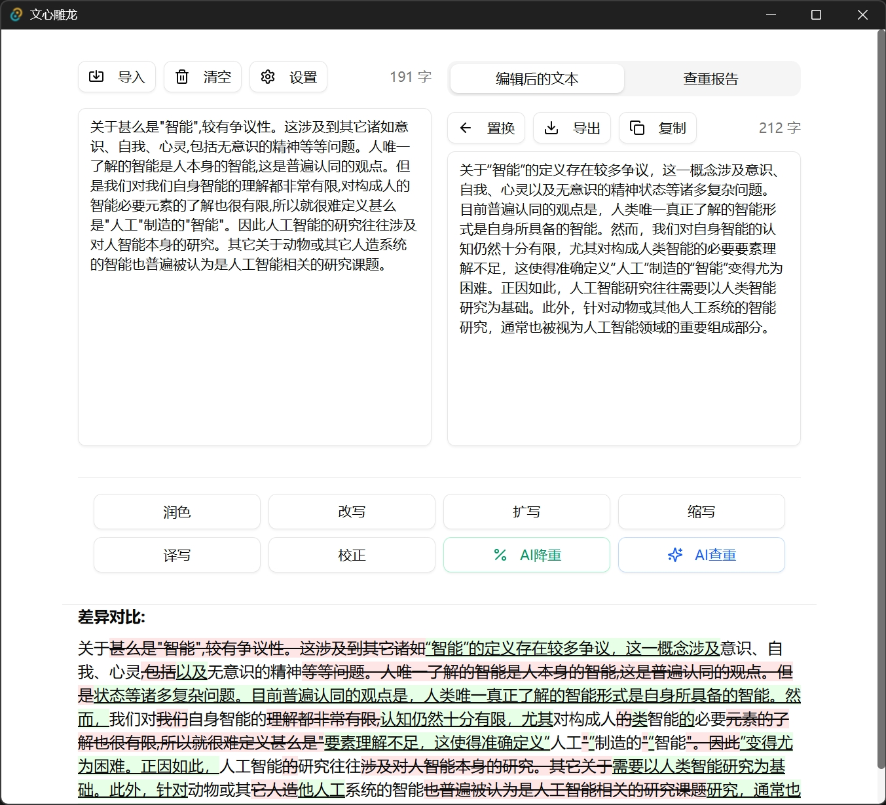
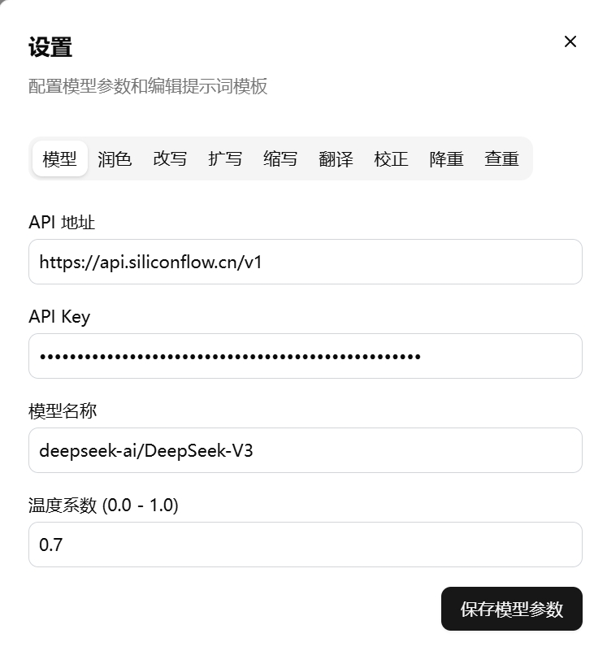

# 📝 PaperPolisher 文心雕龙

<div align="center">


</div>

> 一个基于大语言模型提示词的论文润色工具 ，基于 Tauri + React + TypeScript 构建，致力于提升您的论文质量。



## ✨ 核心功能

- **📋 智能文本润色** - 输入学术文本，获取专业的语言优化和表达建议
- **🔍 抄袭风险检测** - 全面分析文本相似度，生成详细的查重报告
- **📊 实时反馈** - 在独立区域直观展示润色结果和查重情况
- **⚙️ 自定义设置** - 灵活调整润色偏好、模型参数和检测阈值

## 🛠️ 技术栈

- **前端框架**: React 18 + TypeScript + Vite
- **UI 组件库**: shadcn/ui (基于 Tailwind CSS)
- **桌面框架**: Tauri (Rust 后端，高性能、安全且资源占用低)

## 🚀 快速开始

### 前置条件

- Node.js 16+
- Rust 工具链
- pnpm 包管理器

### 安装与运行

1. **克隆仓库并安装依赖**:
   ```bash
   git clone https://github.com/ni00/PaperPolisher.git
   cd PaperPolisher
   pnpm install
   ```

2. **启动开发环境**:
   ```bash
   pnpm tauri dev
   ```

3. **构建生产版本**:
   ```bash
   pnpm tauri build
   ```

## 📖 使用指南

1. 启动应用程序
2. 在设置页面设置好大模型的BaseURL和key。（推荐使用[硅基流动](https://cloud.siliconflow.cn/i/aiD5tTAX)）

3. 在左侧文本区域粘贴或输入您的论文内容
4. 根据需求，调整润色或查重参数
5. 点击对应功能按钮（「润色」或「查重」）
6. 在右侧区域查看处理结果，可以直接复制或导出

> 注意：本项目基于提示词来进行文档润色和AI查重，AI查重的大模型版本，请使用本人开发的[simple-aigc-detect](https://github.com/ni00/simple-aigc-detect)。

## 🤝 贡献指南

欢迎您为 PaperPolisher 做出贡献！无论是功能请求、bug报告还是代码贡献，我们都十分感谢。

1. Fork 本仓库
2. 创建您的特性分支 (`git checkout -b feature/amazing-feature`)
3. 提交您的更改 (`git commit -m 'feat: feature xxx'`)
4. 推送到分支 (`git push origin feature/amazing-feature`)
5. 打开一个 Pull Request

## 📄 许可证

本项目采用 MIT 许可证 - 详情请参阅 [LICENSE](LICENSE) 文件